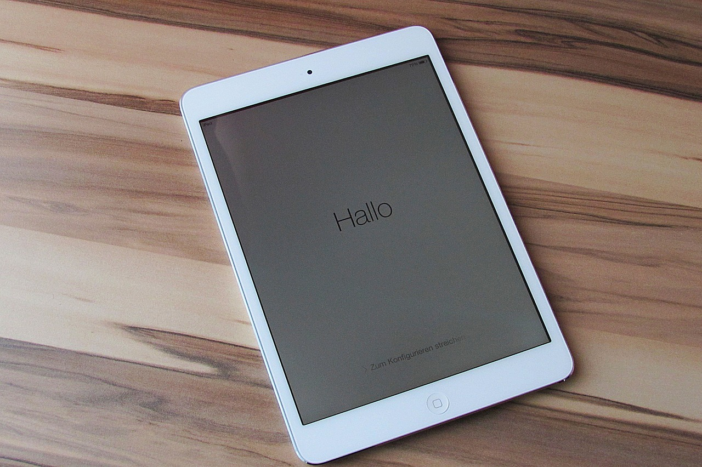
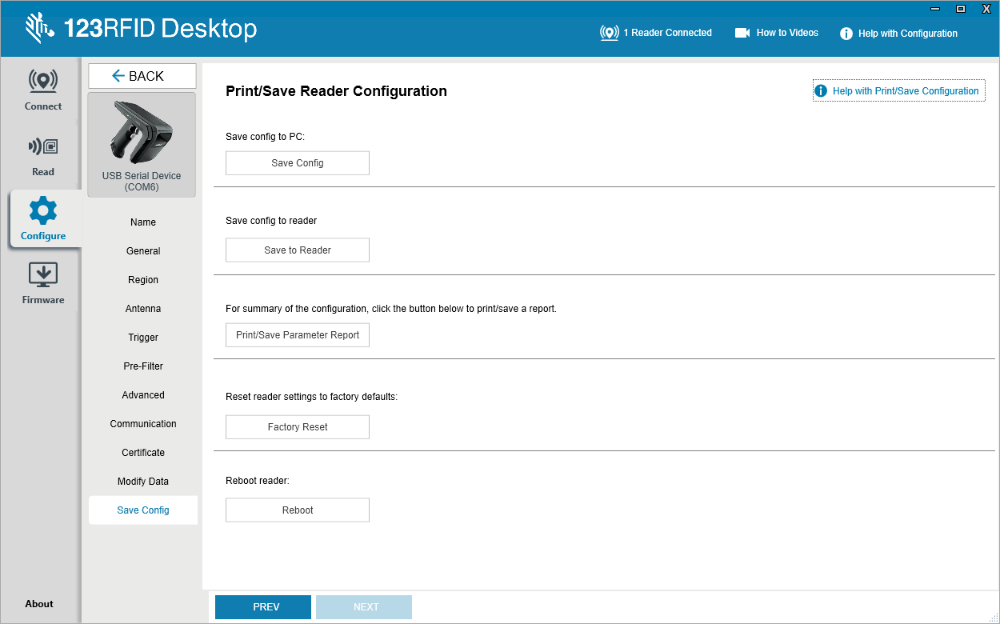
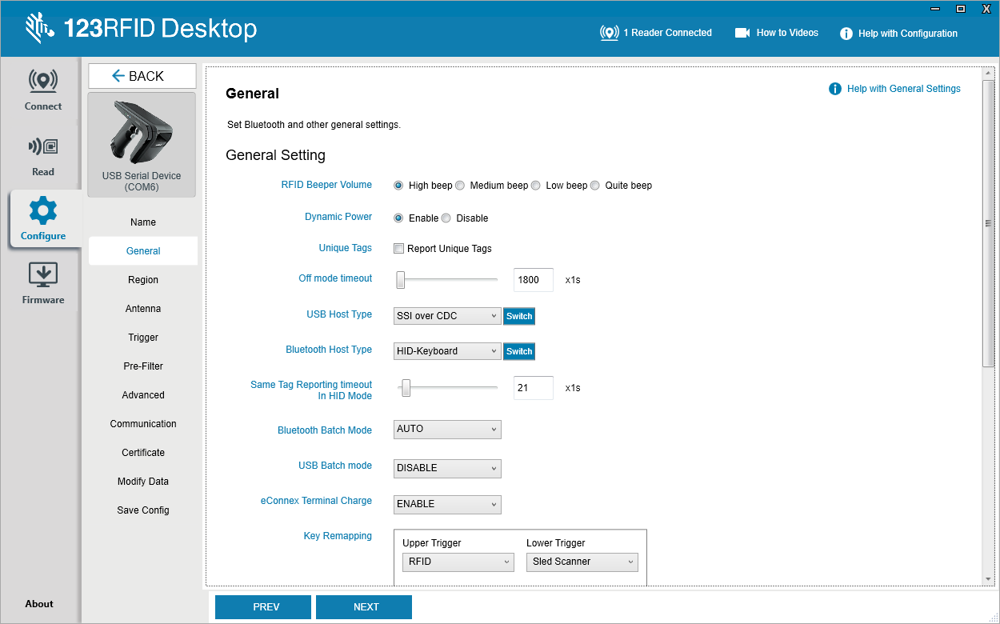
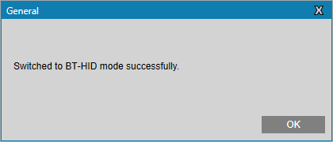
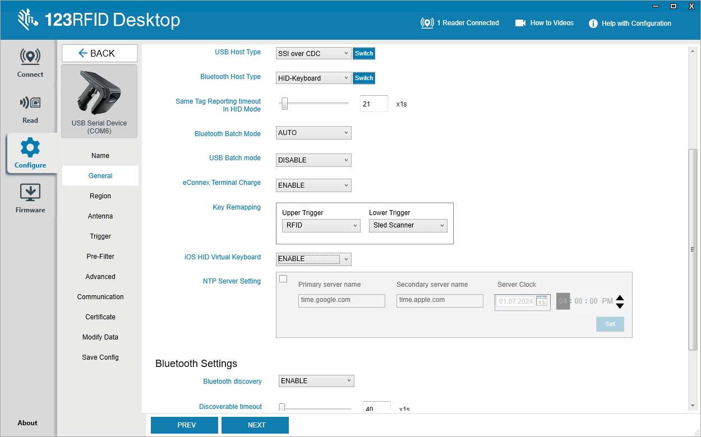
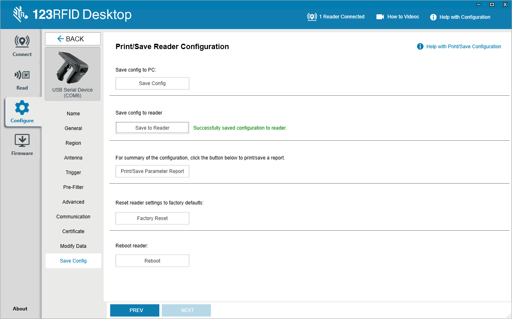
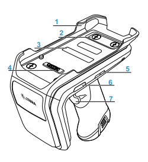
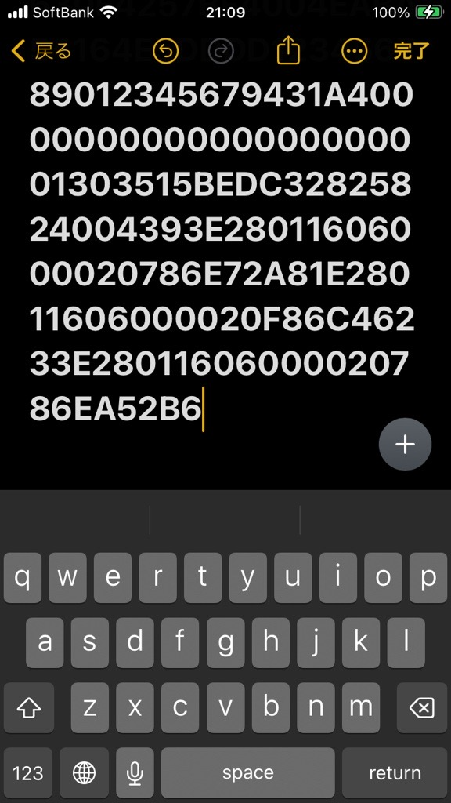

# RFDリーダをiOS端末とHID接続中にソフトキーを利用する方法

Update: 2024/12/04

 

通常、iOSとRFDリーダをHID接続するとiOS上でソフトキーが表示されなくなります。ただ、運用環境によってはソフトキーも使いたいというご要望があります。そのようなユーザ向けにHID接続をしつつ、ソフトキーを利用する方法をご案内致します。

 
 

### 本手順で必要なマテリアル

1. iOS 端末
1. Windows 10 以上のPC 
1. Type A <> Type CのUSBケーブル
1. Zebra RFDリーダー(Bluetooth モデル)

 

### 設定手順

1. Win-PCとRFDをUSB接続する。

1. 123RFIDを起動する。123RFIDは下記リンクよりダウンロード可能。

    [123RFID デスクトップ](https://www.zebra.com/jp/ja/support-downloads/software/rfid-software/123rfid.html)

1. （推奨）123RFIDにて、RFDリーダを初期化する。

    ▽ Factory Resetを選択

    

	 

1. 下記設定を実行する。

    General > Bluetooth Host Type > "HID-Keyboard"を選択 > Switchを押下

    

	 

    設定が成功した場合、下記メッセージが表示されます。
    

	 

1. USBケーブルを抜いて、下記の設定バーコードを読む。

1. 下記設定を実行する。

    General > iOS HID Virtual Kayboard > "ENABLE"を選択 

    

	 

1. 下記設定を実行する。

    Save Config > "Saved to Reader"を選択 

    

	 

### 設定の確認

1. iOS デバイスとBluetooth 接続する。

1. HIDデータを受信できるアプリを起動する。本スレッドでは"メモ"アプリを前提に説明を進める。

1. デフォルト状態ではソフトキーボードは非表示。

    

	 

1. トリガー（下）を素早く２回引くことで、ソフトキーを表示させることができる。

    ▽ 下記図の7を素早く２回引く。

    

	 

    ▽ ソフトキーが表示される。

    

	 

1. ソフトキーを非表示にする場合は、同じ要領でトリガー（下）を素早く２回引く。

	 

以上

